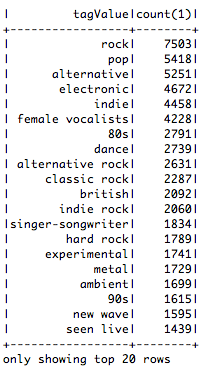
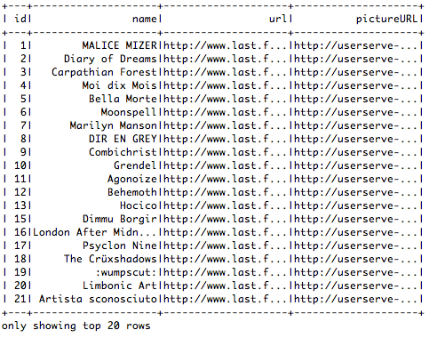
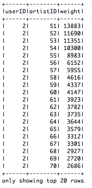
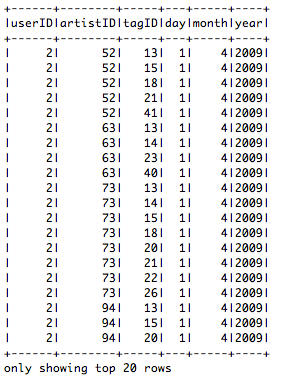
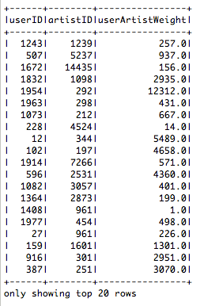
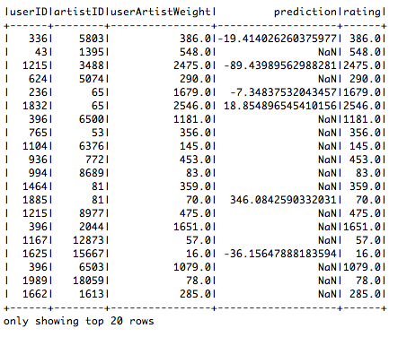
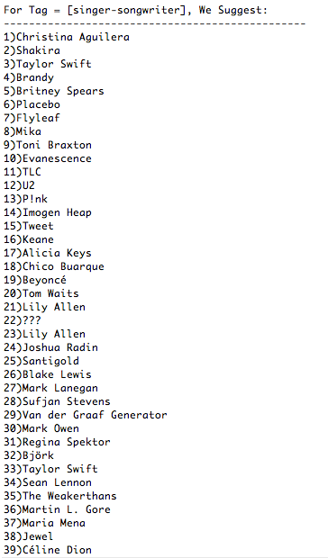
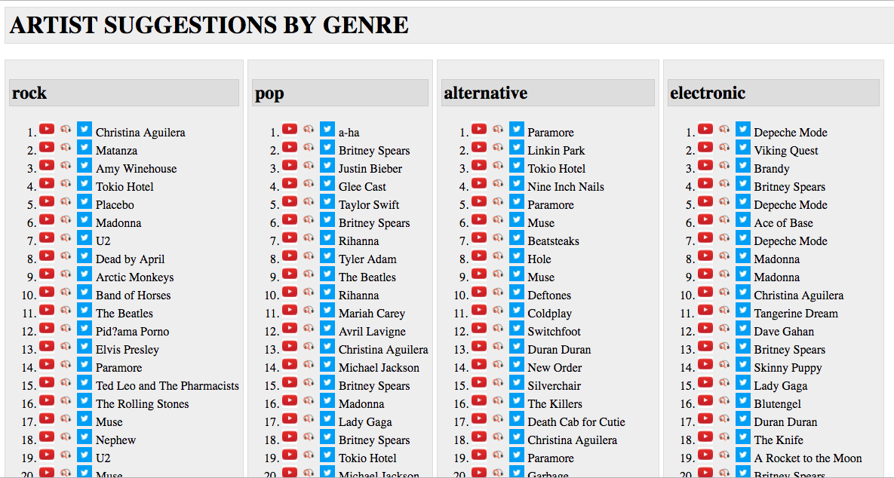

# Music Recommender with User Filters

## This Document

The core work of this project was coded in [Scala](https://www.scala-lang.org/) using the [Apache Spark](https://spark.apache.org/) framework + environment. The code is therefore in an [Eclipse](http://www.eclipse.org/) project, while thie output is in an HTML document, but this document will serve to explain the input, the process, and the output of this final assignment.


## The Mission

* Music listeners have different moods, and often want suggestions within a specific genre.  
* Sometimes recommender system results can suggest music from a genre that the user was not hoping for (ie - when prediciting for a user intent on a rap song, but r&b is recommended). 
* [lastfm](https://www.last.fm/)'s data set [hetrec2011-lastfm-2k](https://grouplens.org/datasets/hetrec-2011/) provides a large set of data including user artist "weights", but also with user artist "tags", which provide us a means of filtering by genre. 
* Because this is such a large data set, the [Apache Spark](https://spark.apache.org/) platform was used
* The [Scala](https://www.scala-lang.org/) programming language was used from an [Eclipse](http://www.eclipse.org/) IDE to perform the recommendations

## The Process

First we query the lastfm tags data set to confirm that this corresponds to music genres that we would like to filter by:

### Tags:



These seem like reasonable music genre's, so we will use these genres in conjunction with the following other data sets to produce our filtered recommendations:

### Artists:



### User_Artists:



### User_Tagged_Artists:



### The Joins and Filter:

With this data in hand, we do a join of the tables combined with a filter for the specified genre as follows:

```{r message=FALSE, echo=TRUE, warning=FALSE, eval=FALSE}
spark.sql("select uta.userID, user_artists.artistID, artists.name, avg(user_artists.weight) as userArtistWeight, uta.tagID, tagValue from artists, tags, user_tagged_artists uta, user_artists where artists.id = uta.artistID and tags.tagID = uta.tagID and uta.userId = user_artists.userID and uta.artistID = user_artists.artistID and tagValue = '" + tagValue + "' group by uta.userID, user_artists.artistID, name, uta.tagID, tagValue")
```



These 3 fields are used as input to our spark recommender: 

which yeilds the following numerical analysis:



and the following recommendations for the specified genre, or tag:



## The Results

These results are output to the following [LARGE SUGGESTIONS HTML DOCUMENT](scala_proj/SUGGESTIONS.html), of which a sample is shown below:



## Conclusion

The outputs in the [LARGE SUGGESTIONS HTML DOCUMENT](scala_proj/SUGGESTIONS.html) definitely represent music by genre, but further, they also seem to show very popular artists per genre.  The suggestions matrix generated by spark's recommender can be used to make specific suggestions to an individual user who gives their specific genre/tag constraints.

