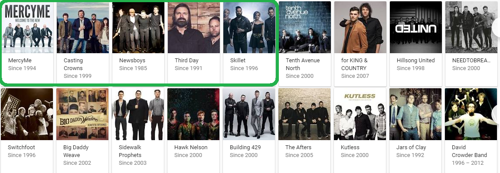
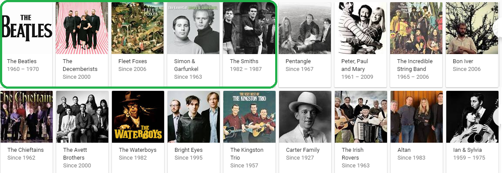
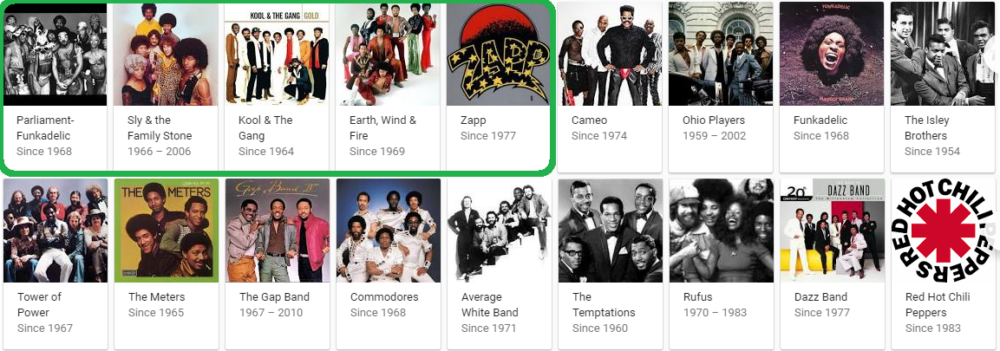

# Matrix Factorization methods

***The last.fm story continued...***


## From previous projects, we:

* Got listen count data from last.fm
* Filtered out the bad rows (?????)
* Derived a 0 to 5 score based on the listen count
* Performed top-N suggestions using UBCF (User Based Collaborative Filtering)
* Performed top-N suggestions using IBCF (Item Based Collaborative Filtering)

## Now, we:
* Query google for "top [music_genre] bands" for 5 specific genres
* Set user 1 to rate (only) google's top 5 bands for that genre a 5/5
* Use recommenderlab's "SVD" strategy to suggest bands when K=200, 100, 50 and 10
* Analyze the differences in K values, see if our suggestions match any of google's top 18

```{r message=FALSE, echo=FALSE, warning=FALSE}
library(recommenderlab)
library(knitr)
library(sqldf)
library(reshape2)
library(ggplot2)
library(Matrix)
library(reshape2)

TRIM_DATA_SIZE <- FALSE
#MAX_TO_LEARN_FROM <- 1000
#MAX_TO_LEARN_FROM <- 5000
MAX_TO_LEARN_FROM <- 25000
RATING_0_TO_THIS <- 5
# the following variable causes the massive slowdown:
NUM_SAMPLE_INDEXES <- 10
# larger FLOOR_LISTEN_COUNTS take out the lesser known bands, make things smaller
FLOOR_LISTEN_COUNTS <- 5
CEILING_LISTEN_COUNTS <- 500

readTSV <- function(f, tmpF){
  lines <- readLines(f)
  lines_with_q <- grep("\\?", lines)
  lines_with_no_q <- lines[-lines_with_q]
  fileConn <- file(tmpF)
  writeLines(lines_with_no_q, fileConn)
  close(fileConn)
  read.table(file = tmpF, sep="\t",  quote = "", header=TRUE, fill=TRUE)
}

artists <- readTSV("data/artists.dat", "data/_TMP_artists.dat");
user_artists <- read.table(file = "data/user_artists.dat", sep="\t",  header=TRUE)

init_listens <- function(){
  user_artist_listen_counts <- sqldf("select userID, artistID, name as artist, weight as listen_count from artists, user_artists where listen_count > 0 and artists.id = user_artists.artistID order by listen_count desc")
  
  # The Ceiling:
  user_artist_listen_counts <- user_artist_listen_counts[user_artist_listen_counts$listen_count < CEILING_LISTEN_COUNTS,]
  
  # The Floor:
  user_artist_listen_counts <- user_artist_listen_counts[user_artist_listen_counts$listen_count > FLOOR_LISTEN_COUNTS,]
  
  # DEV: trim down to something smaller:
  if(TRIM_DATA_SIZE){
    user_artist_listen_counts <- user_artist_listen_counts[c(1:MAX_TO_LEARN_FROM),]
  }

  # HAVE TO DO THIS SAMPLE AT THE END OR ELSE THE MATRIX COL NAMES WILL CHANGE
  user_artist_listen_counts <- user_artist_listen_counts[sample(nrow(user_artist_listen_counts)),]
  # Listen counts as SCORES from 0 to 5:
  listens <- user_artist_listen_counts[,c(1,2,3,4)]
  # inverse_multiplier = 1 means 10 total categories, 2 means 5 total categories, etc.  Lower inverse_multiplier means more granular suggestions, Higher means less granular suggestions 
  # https://stats.stackexchange.com/questions/70801/how-to-normalize-data-to-0-1-range
  listens$listen_count <- (listens$listen_count-min(listens$listen_count))/(max(listens$listen_count)-min(listens$listen_count))
  listens$listen_count <- listens$listen_count * RATING_0_TO_THIS
  listens$listen_count <- round(listens$listen_count, digits = 0)
  kable(head(listens, n=10), caption = "The Core Listen Count Data Simplified into Rankings from 1-5")
  return (listens)
}

init_user_x_artist <- function(listens){
  # col 2 is artistID, col 3 is artist name:
  #user_x_artist <- dcast(listens[,c(1,3,4)], userID ~ artist)
  user_x_artist <- as.matrix(dcast(listens[,c(1,2,4)], userID ~ artistID))
  # paste an a on each col name so we can query it:
  colnames(user_x_artist) <- paste("a", colnames(user_x_artist), sep = "")
  colnames(user_x_artist)[1] <- "userID"
  return (user_x_artist)
}
  
getArtistName <- function(artistID){
  aID <- substring(artistID, 2)
  q <- paste0("select distinct(name) as the_name from artists where id = ",aID)
  qResult <- sqldf(q)
  return (qResult[1,1])
}

recsToDataFrame <- function(recommendations){
  # instantiate empty collections...    
  User <- Rec_1 <- Rec_2 <- Rec_3 <- Rec_4 <- Rec_5 <- Rec_6 <- Rec_7 <- c();
  for(i in c(1:length(recommendations))){
        nextRec <- recommendations[[i]]
        User <- c(User, i)
        Rec_1 <- c(Rec_1, getArtistName(nextRec[1]))
        Rec_2 <- c(Rec_2, getArtistName(nextRec[2]))
        Rec_3 <- c(Rec_3, getArtistName(nextRec[3]))
        Rec_4 <- c(Rec_4, getArtistName(nextRec[4]))
        Rec_5 <- c(Rec_5, getArtistName(nextRec[5]))
        Rec_6 <- c(Rec_6, getArtistName(nextRec[6]))
        Rec_7 <- c(Rec_7, getArtistName(nextRec[7]))
    }
    data.frame(User, Rec_1, Rec_2, Rec_3, Rec_4, Rec_5, Rec_6, Rec_7)
}

do_recs <- function(recType, predictionType, user_x_artist){
  userUserMtrx <- as(user_x_artist, "realRatingMatrix")
  rec_params <- list(k=10,maxiter=100,normalize='center',verbose=FALSE)
  userUserRecommender <- Recommender(userUserMtrx, method = recType, parameter=rec_params)
  
  sample_indexes <- sample(c(1:nrow(userUserMtrx)), size = NUM_SAMPLE_INDEXES, replace = FALSE)

  userUserRecom <- predict(userUserRecommender, userUserMtrx[sample_indexes,], n = 10, type=predictionType)
  
  recsList <- as(userUserRecom, "list")
  return (recsToDataFrame(recsList))
}
```

```{r message=FALSE, echo=FALSE, warning=FALSE, eval=FALSE}
#The first 2: form previous
data <- init_user_x_artist(init_listens())
recs_with_ids <- do_recs("UBCF", "topNList",data)
kable(recs_with_ids, caption="UBCF: User-User topNList")
recs_with_ids <- do_recs("IBCF", "topNList",data)
kable(recs_with_ids, caption="IBCF: Item-Item topNList")
```

```{r message=FALSE, warning=FALSE, echo=FALSE}
data_with_artists <- function(the_artists){
  listens_data <- init_listens()
  # remove all user 1's rows 
  listens_data <- listens_data[listens_data$userID != 1,]
  
  add_artist_for_user <- function(data_in, theArtistName, theUserID, vote0to5){
    theArtistID <- sqldf(paste0("select id from artists where name = '",theArtistName,"'"))
    
    data_in <- rbind(data_in, data.frame(userID = theUserID, artistID = theArtistID[1,1], artist = theArtistName, listen_count = vote0to5))
    return (data_in)
  }

  for(a in the_artists){
    listens_data <- add_artist_for_user(listens_data,a,1,5)
  }
  
  listens_data <- listens_data[with(listens_data, order(userID)), ]
    
  return (listens_data)
}

get_music_suggestions <- function(modified_listens, selected_k){
  user_x_artist_with_added <- data.frame(init_user_x_artist(modified_listens))
  the_ratings_mtrx <- as(as.matrix(user_x_artist_with_added), "realRatingMatrix")
  rec_params <- list(k=selected_k, maxiter=100, normalize='center', verbose=FALSE)
  # the -1 is "1 row of 7 recommendations:
  the_recommender <- Recommender(the_ratings_mtrx[-1,], method="SVD", parameter=rec_params)
  the_recommendations <- predict(the_recommender, the_ratings_mtrx[1,], n=10, type="topNList")
  recommendations <- as(the_recommendations, "list")
  the_caption <- paste0("[K=",selected_k,"] yields the fullowing suggestions:")
  recsDF <- recsToDataFrame(recommendations);
  kDF <- data.frame(K=c(selected_k))
  recsDF <- cbind(kDF,recsDF);
  return(recsDF)
}

# just for layout testing without the long wait:
FIVE_HUNDRED <- 500
TWO_HUNDRED <- 200
ONE_HUNDRED <- 100
FIFTY <- 50
TEN <- 10
```

\newpage

## SVD: google "top classic rock bands"


***

```{r classic_rock, message=FALSE, warning=FALSE, echo=FALSE, eval=TRUE}
genre_data <- data_with_artists(c("The Beatles","Led Zeppelin","Pink Floyd","AC/DC","Guns N'' Roses"))
```

***If USER_1 likes the following artists:***

```{r message=FALSE, warning=FALSE, echo=FALSE, eval=TRUE}
kable(sqldf("select * from genre_data where userID = 1"))
```

***Then we suggest:***

```{r message=FALSE, warning=FALSE, echo=FALSE, eval=TRUE}
suggestionsDF <- data.frame();
suggestionsDF <- rbind(suggestionsDF, get_music_suggestions(genre_data, FIVE_HUNDRED))
suggestionsDF <- rbind(suggestionsDF, get_music_suggestions(genre_data, TWO_HUNDRED))
suggestionsDF <- rbind(suggestionsDF, get_music_suggestions(genre_data, ONE_HUNDRED))
suggestionsDF <- rbind(suggestionsDF, get_music_suggestions(genre_data, FIFTY))
suggestionsDF <- rbind(suggestionsDF, get_music_suggestions(genre_data, TEN))
kable(suggestionsDF)
```

\newpage

## SVD: google "top christian contemporary bands"



***

```{r christian_contemporary, message=FALSE, warning=FALSE, echo=FALSE, eval=TRUE}
genre_data <- data_with_artists(c("MercyMe","Casting Crowns","Newsboys","Third Day","Skillet"))
```

***If USER_1 likes the following artists:***

```{r message=FALSE, warning=FALSE, echo=FALSE, eval=TRUE}
kable(sqldf("select * from genre_data where userID = 1"))
```

***Then we suggest:***

```{r message=FALSE, warning=FALSE, echo=FALSE, eval=TRUE}
suggestionsDF <- data.frame();
suggestionsDF <- rbind(suggestionsDF, get_music_suggestions(genre_data, FIVE_HUNDRED))
suggestionsDF <- rbind(suggestionsDF, get_music_suggestions(genre_data, TWO_HUNDRED))
suggestionsDF <- rbind(suggestionsDF, get_music_suggestions(genre_data, ONE_HUNDRED))
suggestionsDF <- rbind(suggestionsDF, get_music_suggestions(genre_data, FIFTY))
suggestionsDF <- rbind(suggestionsDF, get_music_suggestions(genre_data, TEN))
kable(suggestionsDF)
```

\newpage

## SVD: google "top old school rap bands"


***

```{r old_school_rap, message=FALSE, warning=FALSE, echo=FALSE, eval=TRUE}
genre_data <- data_with_artists(c("Gang Starr","Run-D.M.C.","Public Enemy","Beastie Boys","A Tribe Called Quest"))
```

***If USER_1 likes the following artists:***

```{r message=FALSE, warning=FALSE, echo=FALSE, eval=TRUE}
kable(sqldf("select * from genre_data where userID = 1"))
```

***Then we suggest:***

```{r message=FALSE, warning=FALSE, echo=FALSE, eval=TRUE}
suggestionsDF <- data.frame();
suggestionsDF <- rbind(suggestionsDF, get_music_suggestions(genre_data, FIVE_HUNDRED))
suggestionsDF <- rbind(suggestionsDF, get_music_suggestions(genre_data, TWO_HUNDRED))
suggestionsDF <- rbind(suggestionsDF, get_music_suggestions(genre_data, ONE_HUNDRED))
suggestionsDF <- rbind(suggestionsDF, get_music_suggestions(genre_data, FIFTY))
suggestionsDF <- rbind(suggestionsDF, get_music_suggestions(genre_data, TEN))
kable(suggestionsDF)
```

\newpage

## SVD: google "top folk bands"



***

```{r folk, message=FALSE, warning=FALSE, echo=FALSE, eval=TRUE}
genre_data <- data_with_artists(c("The Beatles","The Decemberists","Fleet Foxes","Simon & Garfunkel","The Smiths"))
```

***If USER_1 likes the following artists:***

```{r message=FALSE, warning=FALSE, echo=FALSE, eval=TRUE}
kable(sqldf("select * from genre_data where userID = 1"))
```

***Then we suggest:***

```{r message=FALSE, warning=FALSE, echo=FALSE, eval=TRUE}
suggestionsDF <- data.frame();
suggestionsDF <- rbind(suggestionsDF, get_music_suggestions(genre_data, FIVE_HUNDRED))
suggestionsDF <- rbind(suggestionsDF, get_music_suggestions(genre_data, TWO_HUNDRED))
suggestionsDF <- rbind(suggestionsDF, get_music_suggestions(genre_data, ONE_HUNDRED))
suggestionsDF <- rbind(suggestionsDF, get_music_suggestions(genre_data, FIFTY))
suggestionsDF <- rbind(suggestionsDF, get_music_suggestions(genre_data, TEN))
kable(suggestionsDF)
```

\newpage

## SVD: google "top funk bands"



***

```{r funk, message=FALSE, warning=FALSE, echo=FALSE, eval=TRUE}
genre_data <- data_with_artists(c("Funkadelic","Sly & The Family Stone","Kool & The Gang","Earth, Wind & Fire","Cameo"))
```

***If USER_1 likes the following artists:***

```{r message=FALSE, warning=FALSE, echo=FALSE, eval=TRUE}
kable(sqldf("select * from genre_data where userID = 1"))
```

***Then we suggest:***

```{r message=FALSE, warning=FALSE, echo=FALSE, eval=TRUE}
suggestionsDF <- data.frame();
suggestionsDF <- rbind(suggestionsDF, get_music_suggestions(genre_data, FIVE_HUNDRED))
suggestionsDF <- rbind(suggestionsDF, get_music_suggestions(genre_data, TWO_HUNDRED))
suggestionsDF <- rbind(suggestionsDF, get_music_suggestions(genre_data, ONE_HUNDRED))
suggestionsDF <- rbind(suggestionsDF, get_music_suggestions(genre_data, FIFTY))
suggestionsDF <- rbind(suggestionsDF, get_music_suggestions(genre_data, TEN))
kable(suggestionsDF)
```

\newpage

# Conclusions
* The value of K makes an exponential difference in ***accuracy***
* The value of K makes an exponential difference in ***performance***
* Matrix Factorization allows for analysis of a much larger data set than without
* Run-time was not an issue for smaller K's, but unfortunately, as the predictions started getting better and better with larger K values, the performance again became a major issue - even though SVD was being used for dimensionality reduction
* In general, the large K's seemed to have some good suggestions, but not good enough to use to actually choose content.  It's probably a good idea to be using an ensemble of strategies rather than just this one.